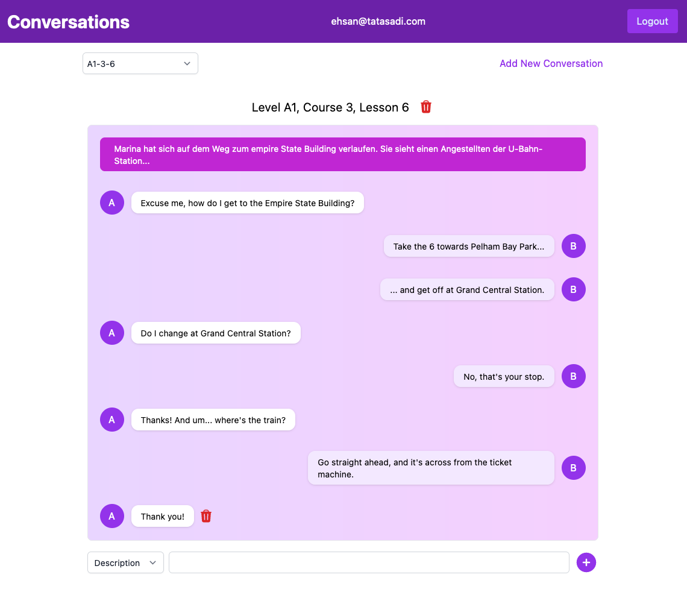

# Save Conversations to learn them by heart

This web application is made by [Remix](https://remix.run/) and used [Remix Indie Stack](https://github.com/remix-run/indie-stack).

In order to use it you can create a database and put the connection string in .env (like .env.exmple).

You can then run

```sh
npx prisma migrate dev --name init
```

Fill the `prisma/seed.ts` with whatever you want and then run:

```sh
npx prisma db seed
```

to sync your database.

You can then start dev server:

```sh
npm run dev
```

This starts your app in development mode, rebuilding assets on file changes.

The database seed script creates a new user with some data you can use to get started:

Here is a screen shot of a saved conversation:



You can add a new conversation, add different sentences to it, remove the last sentence of the conversation or remove the whole conversation.

The conversations belong to the user who created it and nobody else can see it. 
